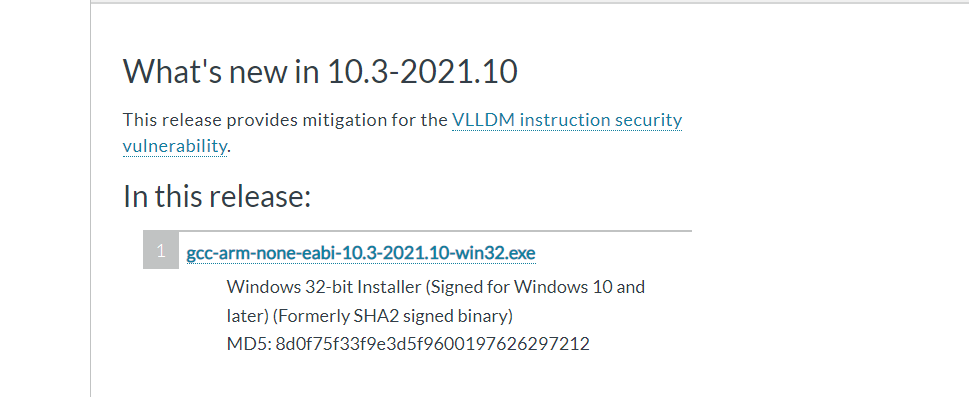
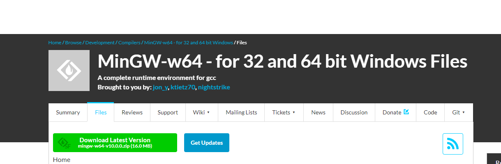
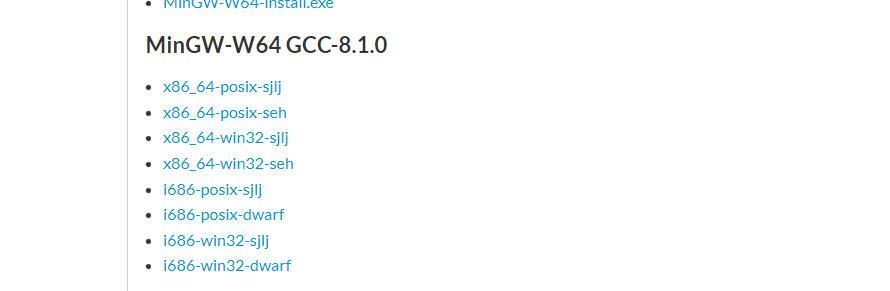
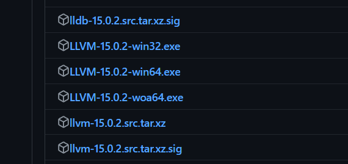
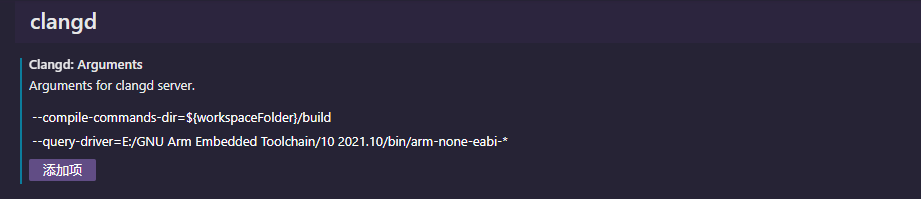
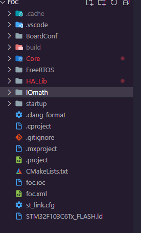
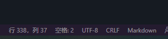
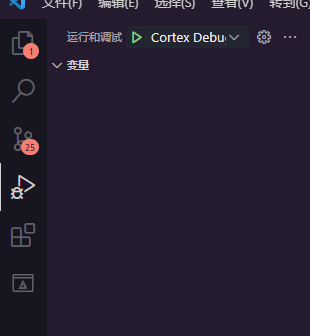

# Windows下使用vscode开发stm32

## 写在开头

有条件的用clion，方法更简单，具体教程参考知乎稚晖君教程[《配置CLion用于STM32开发【优雅の嵌入式开发》(点击跳转)](https://zhuanlan.zhihu.com/p/145801160)

起初搭建环境的想法是keil对stm32hal库的支持太不友好了，用ac5编译器编译hal库程序非常慢，想要快点又必须关闭跳转功能，使用ac6虽然速度很快，但对于cubemx生成的freertos中汇编代码无法支持，需要修改汇编代码才能正常编译，同时ac6编译器对跳转功能支持不是很完善，经常出现跳转失败的情况。

不如转向更加现代的vscode，支持更多功能，同时使用的很多工具都是开源工具，不用付费同时还没有没有版权问题。

但如果你是专业的嵌入式工作者，本方案还有些不足，建议还是使用更加专业的IDE

## 预先准备软件

以下软件的安装教程请百度，也可以参考稚晖君的教程

有些软件的下载地址在国外，下载时非常慢，建议使用代理

- vscode 代码编辑器
- arm-none-eabi-gcc 编译器
- cmake 编译工具
- mingw 提供GNU工具
- openocd 调试下载
- stm32cubemx 代码生成
- llvm 用于代码前端分析(选装)

### vscode
[下载地址(点击跳转)](https://code.visualstudio.com/)


#### 安装的插件
- c/c++
- cmake(选装)
- cmake tools(选装)
- cortex-debug
- cortex-debug支持包(根据自己的芯片类型安装)
- clangd(选装)

c/c++与clangd二选一，两者同时安装会存在冲突。使用一个时可以禁用另一个，这边还是建议使用clangd

### arm-none-eabi-gcc

交叉编译器，允许在主机上编译嵌入式设备的程序。这个编译器主要针对arm系列的cortex-m内核。

[下载地址(点击跳转)](https://developer.arm.com/downloads/-/gnu-rm)


选择如图所示安装包



#### 添加环境变量

打开安装的文件夹（安装时会弹出安装的文件夹），
然后打开bin文件夹，将bin文件夹目录添加到环境变量

### cmake

跨平台的构建工具，目前在c/c++项目中使用非常广泛

[下载地址(点击跳转)](https://cmake.org/download/)

安装时请勾选添加到环境变量

### mingw

全称 *Minimalist GNU for Windows* ，在windows上提供一些gun的工具。我们这里主要使用make。它内部也包含gcc编译器，可以用于编译c/c++代码

[下载地址(点击跳转)](https://sourceforge.net/projects/mingw-w64/files/)

选择file



下滑，选择x86_64-win32-sjij


下载解压后复制将mingw文件夹复制到你想要放置的目录即可
#### 添加环境变量

同样的把bin目录添加到环境变量

### openocd

开源的调试下载软件

[下载地址(点击跳转)](https://gnutoolchains.com/arm-eabi/openocd/)

选择最新版

下载解压后复制将openocd文件夹复制到你想要放置的目录即可

#### 添加环境变量

同样的把bin目录添加到环境变量

### stm32cubemx

st官方推出的单片机图形化配置器

[下载地址(点击跳转)](https://www.st.com/en/development-tools/stm32cubemx.html)

### llvm

为什么要使用llvm，了解过c/c++插件奇慢无比的反应时间就能理解为什么选用llvm中的clangd

为了自己的心理健康建议安装llvm

[下载地址(点击跳转)](https://github.com/llvm/llvm-project/releases/tag/llvmorg-15.0.2)



选择LLVM-15.0.2-win64.exe

安装时也可以勾选添加到环境变量

LLVM是构架编译器(compiler)的框架系统，以C++编写而成，用于优化以任意程序语言编写的程序的编译时间(compile-time)、链接时间(link-time)、运行时间(run-time)以及空闲时间(idle-time)，对开发者保持开放，并兼容已有脚本

目前仅使用llvm的前端功能，用于代码分析和提示。llvm内部也包含了clang，clang也是一个c/c++编译器

clangd就是llvm前端部分。在vscode中添加clangd插件即可在vscode中使用clangd


在vscode的clangd插件设置部分添加以下两个参数
```
--compile-commands-dir=${workspaceFolder}/build
--query-driver=E:/GNU Arm Embedded Toolchain/10 2021.10/bin/arm-none-eabi-*
```


第一个将使用cmake产生的文件来作为clangd寻找头文件的依据

但是还是会提示找不到c语言的标准库文件

第二个就是通过交叉编译器查询c的标准库文件，填写时请将目录改变为自己的交叉编译器安装目录

**下面的问题逼死强迫症**
> 但在core_cmx.h头文件中还是会提示很多错误，这是因为st官方库写法问题导致clangd无法正确识别，目前没有找到关闭这些错误提示的方法，只能人工选择性忽略这些错误

## 使用教程

### 使用stm32cubemx生成代码

关于stm32cubemx的使用这里不介绍了，在最后生成代码时选择sw4stm32


### 使用vscode打开目录

### 添加launch.json文件

点击左边运行和调试


点击“创建launch.json文件”

之后会在根目录下生成一个.vscode文件夹，打开文件夹的launch.json文件,，删除文件内所有内容，将以下代码复制到本文件内，并按要求修改

```json
{
    // 使用 IntelliSense 了解相关属性。 
    // 悬停以查看现有属性的描述。
    // 欲了解更多信息，请访问: https://go.microsoft.com/fwlink/?linkid=830387
    "version": "0.2.0",
    "configurations": [
        {
            "name": "Cortex Debug",
            "cwd": "${workspaceRoot}",
            "executable": "./cmake-build-debug/foc.elf",//foc.elf中的foc是工程名，写在cmakelists.txt中，请根据自己的工程名进行修改
            "request": "launch",
            "type": "cortex-debug",
            "servertype": "openocd",
            "device": "STM32F103C6",//芯片类型，根据自己芯片类型进行修改
            "configFiles": [
                "-f",
				"interface/stlink.cfg",//调试器类型，根据自己调试器类型名称修改
				"-f",
				"target/stm32f1x.cfg",//芯片类型，根据自己芯片类型进行修改，比如是stm32f4系列，就改为stm32f4x.cfg
            ],
            "preLaunchTask": "Build"
            
        }
    ]
}
```
### 添加tasks.json文件
在.vscode目录创建tasks.json文件,将以下内容复制到文件内，并按要求修改
```json
{
	"version": "2.0.0",
	"options": {
		"cwd": "${workspaceFolder}/build" //进入build文件夹的绝对路径
	},
	//一个tasks中包含着三个小task
	"tasks": [
		{
			"label": "flash", //task名称
			"command": "openocd", //task命令
			//调用命令时传递的参数
			"args": [
				"-f",
				"interface/stlink.cfg",//调试器类型，根据自己调试器类型名称修改
				"-f",
				"target/stm32f1x.cfg",//芯片类型，根据自己芯片类型进行修改，比如是stm32f4系列，就改为stm32f4x.cfg
				"-c",
				"program build/foc.elf verify reset exit"
			]
		},
		{
			"type": "shell", //定义任务是被认为是进程还是在shell中运行
			"label": "cmake", //task名称
			"command": "cmake", //task命令
			//调用命令时传递的参数
			"args": [
				"..",
				"-G",
				"MinGW Makefiles"
			]
		},
		{
			"label": "make", //task名称
			"group": {
				"kind": "build",
				"isDefault": true
			},
			"command": "mingw32-make", //task命令
			"args": [] //参数：无
		},
		{
			"label": "Build", //task名称，和launch中preLaunchTask一样
			"dependsOrder": "sequence", //按列出的顺序执行任务依赖项
			//依赖项
			"dependsOn": [
				"cmake",
				"make",
				"flash"
			]
		}
	]
}
```

### 添加CMakeLists.txt文件


在根目录新建CMakeLists.txt文件，将以下内容复制到文件内，并按要求修改
```cmake
set(CMAKE_SYSTEM_NAME Generic)
set(CMAKE_SYSTEM_VERSION 1)
cmake_minimum_required(VERSION 3.20)

# specify cross compilers and tools
set(CMAKE_C_COMPILER arm-none-eabi-gcc)#c编译器
set(CMAKE_CXX_COMPILER arm-none-eabi-g++)#cpp编译器
set(CMAKE_ASM_COMPILER  arm-none-eabi-gcc)#汇编编译器
set(CMAKE_AR arm-none-eabi-ar)
set(CMAKE_OBJCOPY arm-none-eabi-objcopy)
set(CMAKE_OBJDUMP arm-none-eabi-objdump)
set(SIZE arm-none-eabi-size)
set(CMAKE_TRY_COMPILE_TARGET_TYPE STATIC_LIBRARY)

# project settings
# foc是工程名字
project(foc C CXX ASM)
set(CMAKE_CXX_STANDARD 17)
set(CMAKE_C_STANDARD 11)

#以下是硬件浮点数的支持，关闭注释打开本功能（对于stm32f4系列可以打开本功能）
#Uncomment for hardware floating point
# add_compile_definitions(ARM_MATH_CM4;ARM_MATH_MATRIX_CHECK;ARM_MATH_ROUNDING)
# add_compile_options(-mfloat-abi=hard -mfpu=fpv4-sp-d16)
# add_link_options(-mfloat-abi=hard -mfpu=fpv4-sp-d16)

#以下是软件浮点数的支持，关闭注释打开本功能
#Uncomment for software floating point
#add_compile_options(-mfloat-abi=soft)

# cortex-m3是f1系列的内核，如果是f4可以写改为cortex-m4
add_compile_options(-mcpu=cortex-m3 -mthumb )
add_compile_options(-ffunction-sections -fdata-sections -fno-common -fmessage-length=0)

# uncomment to mitigate c++17 absolute addresses warnings
#set(CMAKE_CXX_FLAGS "${CMAKE_CXX_FLAGS} -Wno-register")

if ("${CMAKE_BUILD_TYPE}" STREQUAL "Release")
    message(STATUS "Maximum optimization for speed")
    add_compile_options(-Ofast)
elseif ("${CMAKE_BUILD_TYPE}" STREQUAL "RelWithDebInfo")
    message(STATUS "Maximum optimization for speed, debug info included")
    add_compile_options(-Ofast -g)
elseif ("${CMAKE_BUILD_TYPE}" STREQUAL "MinSizeRel")
    message(STATUS "Maximum optimization for size")
    add_compile_options(-Os)
else ()
    message(STATUS "Minimal optimization, debug info included")
    add_compile_options(-Og -g)
endif ()

# 以下是头文件目录
include_directories(
Core/Inc 
Drivers/STM32F1xx_HAL_Driver/Inc 
Drivers/STM32F1xx_HAL_Driver/Inc/Legacy 
Middlewares/Third_Party/FreeRTOS/Source/include 
Middlewares/Third_Party/FreeRTOS/Source/CMSIS_RTOS 
Middlewares/Third_Party/FreeRTOS/Source/portable/GCC/ARM_CM3
Drivers/CMSIS/Device/ST/STM32F1xx/Include 
Drivers/CMSIS/Include 
)

# 添加芯片型号的宏定义，对于型号，可以打开Drivers\CMSIS\Device\ST\STM32F1xx\Include\文件夹，根据头文件名称填写
add_definitions(-DUSE_HAL_DRIVER -DSTM32F103x6)

# 源文件目录
file(GLOB_RECURSE SOURCES "startup/*.*" "Middlewares/*.*" "Drivers/*.*" "Core/*.*" )

# 链接文件名字，请修改为根目录下.ld文件名字
set(LINKER_SCRIPT ${CMAKE_SOURCE_DIR}/STM32F103C6Tx_FLASH.ld)

add_link_options(-Wl,-gc-sections,--print-memory-usage,-Map=${PROJECT_BINARY_DIR}/${PROJECT_NAME}.map)
# cortex-m3是f1系列的内核，如果是f4可以写改为cortex-m4
add_link_options(-mcpu=cortex-m3 -mthumb )
add_link_options(-T ${LINKER_SCRIPT})

add_executable(${PROJECT_NAME}.elf ${SOURCES} ${LINKER_SCRIPT})

set(HEX_FILE ${PROJECT_BINARY_DIR}/${PROJECT_NAME}.hex)
set(BIN_FILE ${PROJECT_BINARY_DIR}/${PROJECT_NAME}.bin)

add_custom_command(TARGET ${PROJECT_NAME}.elf POST_BUILD
        COMMAND ${CMAKE_OBJCOPY} -Oihex $<TARGET_FILE:${PROJECT_NAME}.elf> ${HEX_FILE}
        COMMAND ${CMAKE_OBJCOPY} -Obinary $<TARGET_FILE:${PROJECT_NAME}.elf> ${BIN_FILE}
        COMMENT "Building ${HEX_FILE}
Building ${BIN_FILE}")
```

### .clang-format文件

clang-format是一个代码格式化工具,c/c++插件内置这个工具

.clang-format用于提供给clang-format代码的格式

如果使用vscode内部默认的代码格式化的格式，则不需要这个文件

如果你vscode安装了c/c++插件，clang-format集成在了c/c++插件中

电脑中有everything的可以直接搜索clang-format.exe

在clang-format所在目录打开终端，输入

```
.\clang-format.exe -style=可选格式名 -dump-config > .clang-format
```
命令中的可选格式名可以为`google`等，其它的格式名请百度

输出的.clang-format复制到工程的根目录中



也可以自己新建一个.clang-format文件

将以下内容复制到文件内（使用的也是google的格式，但根据自己的喜好做了一些小修改）

以下格式的具体内容可以自己根据单词理解

> 注意：请将文件改为UTF-8格式，在vscode打开本文件，如果在右下角选择编码项不是UTF-8类型，先复制文件内容，然后将文件内容全部删除，点击它，通过编码保存，选择UTF-8类型，最后将文件内容粘贴进本文件就行了




```yaml
---
Language:        Cpp
# BasedOnStyle:  Google
AccessModifierOffset: -1
AlignAfterOpenBracket: Align
AlignArrayOfStructures: None
AlignConsecutiveMacros: None
AlignConsecutiveAssignments: None
AlignConsecutiveBitFields: None
AlignConsecutiveDeclarations: None
AlignEscapedNewlines: Left
AlignOperands:   Align
AlignTrailingComments: true
AllowAllArgumentsOnNextLine: true
AllowAllParametersOfDeclarationOnNextLine: true
AllowShortEnumsOnASingleLine: true
AllowShortBlocksOnASingleLine: Never
AllowShortCaseLabelsOnASingleLine: false
AllowShortFunctionsOnASingleLine: All
AllowShortLambdasOnASingleLine: All
AllowShortIfStatementsOnASingleLine: WithoutElse
AllowShortLoopsOnASingleLine: true
AlwaysBreakAfterDefinitionReturnType: None
AlwaysBreakAfterReturnType: None
AlwaysBreakBeforeMultilineStrings: true
AlwaysBreakTemplateDeclarations: Yes
AttributeMacros:
  - __capability
BinPackArguments: true
BinPackParameters: true
BraceWrapping:
  AfterCaseLabel:  false
  AfterClass:      false
  AfterControlStatement: Never
  AfterEnum:       false
  AfterFunction:   false
  AfterNamespace:  false
  AfterObjCDeclaration: false
  AfterStruct:     false
  AfterUnion:      false
  AfterExternBlock: false
  BeforeCatch:     false
  BeforeElse:      false
  BeforeLambdaBody: false
  BeforeWhile:     false
  IndentBraces:    false
  SplitEmptyFunction: true
  SplitEmptyRecord: true
  SplitEmptyNamespace: true
BreakBeforeBinaryOperators: None
BreakBeforeConceptDeclarations: true
BreakBeforeBraces: Attach
BreakBeforeInheritanceComma: false
BreakInheritanceList: BeforeColon
BreakBeforeTernaryOperators: true
BreakConstructorInitializersBeforeComma: false
BreakConstructorInitializers: BeforeColon
BreakAfterJavaFieldAnnotations: false
BreakStringLiterals: true
ColumnLimit:     150
CommentPragmas:  '^ IWYU pragma:'
QualifierAlignment: Leave
CompactNamespaces: false
ConstructorInitializerIndentWidth: 4
ContinuationIndentWidth: 4
Cpp11BracedListStyle: true
DeriveLineEnding: true
DerivePointerAlignment: true
DisableFormat:   false
EmptyLineAfterAccessModifier: Never
EmptyLineBeforeAccessModifier: LogicalBlock
ExperimentalAutoDetectBinPacking: false
PackConstructorInitializers: NextLine
BasedOnStyle:    ''
ConstructorInitializerAllOnOneLineOrOnePerLine: false
AllowAllConstructorInitializersOnNextLine: true
FixNamespaceComments: true
ForEachMacros:
  - foreach
  - Q_FOREACH
  - BOOST_FOREACH
IfMacros:
  - KJ_IF_MAYBE
IncludeBlocks:   Regroup
IncludeCategories:
  - Regex:           '^<ext/.*\.h>'
    Priority:        2
    SortPriority:    0
    CaseSensitive:   false
  - Regex:           '^<.*\.h>'
    Priority:        1
    SortPriority:    0
    CaseSensitive:   false
  - Regex:           '^<.*'
    Priority:        2
    SortPriority:    0
    CaseSensitive:   false
  - Regex:           '.*'
    Priority:        3
    SortPriority:    0
    CaseSensitive:   false
IncludeIsMainRegex: '([-_](test|unittest))?$'
IncludeIsMainSourceRegex: ''
IndentAccessModifiers: false
IndentCaseLabels: true
IndentCaseBlocks: false
IndentGotoLabels: true
IndentPPDirectives: None
IndentExternBlock: AfterExternBlock
IndentRequires:  false
IndentWidth:     4
IndentWrappedFunctionNames: false
InsertTrailingCommas: None
JavaScriptQuotes: Leave
JavaScriptWrapImports: true
KeepEmptyLinesAtTheStartOfBlocks: false
LambdaBodyIndentation: Signature
MacroBlockBegin: ''
MacroBlockEnd:   ''
MaxEmptyLinesToKeep: 1
NamespaceIndentation: None
ObjCBinPackProtocolList: Never
ObjCBlockIndentWidth: 2
ObjCBreakBeforeNestedBlockParam: true
ObjCSpaceAfterProperty: false
ObjCSpaceBeforeProtocolList: true
PenaltyBreakAssignment: 2
PenaltyBreakBeforeFirstCallParameter: 1
PenaltyBreakComment: 300
PenaltyBreakFirstLessLess: 120
PenaltyBreakOpenParenthesis: 0
PenaltyBreakString: 1000
PenaltyBreakTemplateDeclaration: 10
PenaltyExcessCharacter: 1000000
PenaltyReturnTypeOnItsOwnLine: 200
PenaltyIndentedWhitespace: 0
PointerAlignment: Left
PPIndentWidth:   -1
RawStringFormats:
  - Language:        Cpp
    Delimiters:
      - cc
      - CC
      - cpp
      - Cpp
      - CPP
      - 'c++'
      - 'C++'
    CanonicalDelimiter: ''
    BasedOnStyle:    google
  - Language:        TextProto
    Delimiters:
      - pb
      - PB
      - proto
      - PROTO
    EnclosingFunctions:
      - EqualsProto
      - EquivToProto
      - PARSE_PARTIAL_TEXT_PROTO
      - PARSE_TEST_PROTO
      - PARSE_TEXT_PROTO
      - ParseTextOrDie
      - ParseTextProtoOrDie
      - ParseTestProto
      - ParsePartialTestProto
    CanonicalDelimiter: pb
    BasedOnStyle:    google
ReferenceAlignment: Pointer
ReflowComments:  true
RemoveBracesLLVM: false
SeparateDefinitionBlocks: Leave
ShortNamespaceLines: 1
SortIncludes:    CaseSensitive
SortJavaStaticImport: Before
SortUsingDeclarations: true
SpaceAfterCStyleCast: false
SpaceAfterLogicalNot: false
SpaceAfterTemplateKeyword: true
SpaceBeforeAssignmentOperators: true
SpaceBeforeCaseColon: false
SpaceBeforeCpp11BracedList: false
SpaceBeforeCtorInitializerColon: true
SpaceBeforeInheritanceColon: true
SpaceBeforeParens: ControlStatements
SpaceBeforeParensOptions:
  AfterControlStatements: true
  AfterForeachMacros: true
  AfterFunctionDefinitionName: false
  AfterFunctionDeclarationName: false
  AfterIfMacros:   true
  AfterOverloadedOperator: false
  BeforeNonEmptyParentheses: false
SpaceAroundPointerQualifiers: Default
SpaceBeforeRangeBasedForLoopColon: true
SpaceInEmptyBlock: false
SpaceInEmptyParentheses: false
SpacesBeforeTrailingComments: 2
SpacesInAngles:  Never
SpacesInConditionalStatement: false
SpacesInContainerLiterals: true
SpacesInCStyleCastParentheses: false
SpacesInLineCommentPrefix:
  Minimum:         1
  Maximum:         -1
SpacesInParentheses: false
SpacesInSquareBrackets: false
SpaceBeforeSquareBrackets: false
BitFieldColonSpacing: Both
Standard:        Auto
StatementAttributeLikeMacros:
  - Q_EMIT
StatementMacros:
  - Q_UNUSED
  - QT_REQUIRE_VERSION
TabWidth:        8
UseCRLF:         false
UseTab:          Never
WhitespaceSensitiveMacros:
  - STRINGIZE
  - PP_STRINGIZE
  - BOOST_PP_STRINGIZE
  - NS_SWIFT_NAME
  - CF_SWIFT_NAME
...

```

### 创建build目录

在根目录创建build目录，用于存放编译产生的中间文件

### 编译、下载与调试

点击运行和调试，选择cortex-debug，点击开始调试（或者按F5）就可以一步执行编译、下载和调试



## Linux下的环境搭建

通过命令安装软件更简单，甚至连c环境和环境变量都不用配置，将目录改为Linux下的目录就行……
